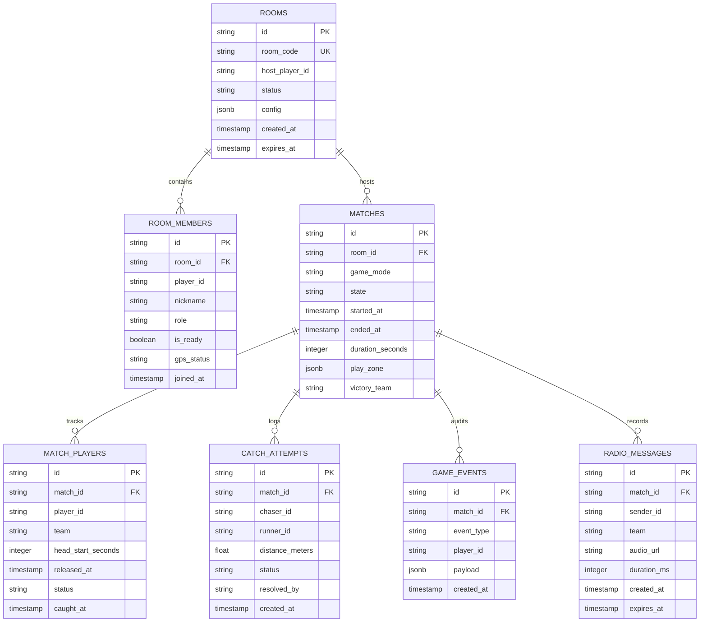

# Database Schema Specification

The persistence model supports both local development (SQLite / in-memory PostgreSQL compatible) and cloud production (Supabase / standard PostgreSQL).

```mermaid
erDiagram
    ROOMS ||--o{ ROOM_MEMBERS : contains
    ROOMS ||--o{ MATCHES : hosts
    MATCHES ||--o{ MATCH_PLAYERS : tracks
    MATCHES ||--o{ CATCH_ATTEMPTS : logs
    MATCHES ||--o{ GAME_EVENTS : audits
    MATCHES ||--o{ RADIO_MESSAGES : records

    ROOMS {
        string id PK
        string room_code UK
        string host_player_id
        string status
        jsonb config
        timestamp created_at
        timestamp expires_at
    }

    ROOM_MEMBERS {
        string id PK
        string room_id FK
        string player_id
        string nickname
        string role
        boolean is_ready
        string gps_status
        timestamp joined_at
    }

    MATCHES {
        string id PK
        string room_id FK
        string game_mode
        string state
        timestamp started_at
        timestamp ended_at
        integer duration_seconds
        jsonb play_zone
        string victory_team
    }

    MATCH_PLAYERS {
        string id PK
        string match_id FK
        string player_id
        string team
        integer head_start_seconds
        timestamp released_at
        string status
        timestamp caught_at
    }

    CATCH_ATTEMPTS {
        string id PK
        string match_id FK
        string chaser_id
        string runner_id
        float distance_meters
        string status
        string resolved_by
        timestamp created_at
    }

    RADIO_MESSAGES {
        string id PK
        string match_id FK
        string sender_id
        string team
        string audio_url
        integer duration_ms
        timestamp created_at
        timestamp expires_at
    }

    GAME_EVENTS {
        string id PK
        string match_id FK
        string event_type
        string player_id
        jsonb payload
        timestamp created_at
    }
```
